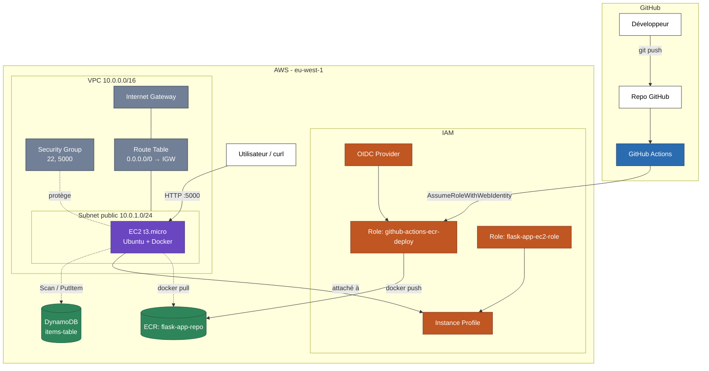

# AWS Terraform Flask CI/CD

Infrastructure AWS complète en **Terraform**, application **Flask** conteneurisée avec **Docker**, déploiement automatisé via **GitHub Actions** — un mini-cycle DevOps de bout en bout, du code à l'infrastructure jusqu'au déploiement continu.

## 🎯 Objectif du projet

Ce projet est un portfolio technique démontrant une maîtrise pratique de :
- L'**Infrastructure as Code** avec Terraform (réseau, sécurité, calcul, IAM)
- La **conteneurisation** avec Docker (build multi-stage)
- Le **CI/CD** avec GitHub Actions et authentification **OIDC** (sans clés IAM stockées)
- Les principes **IAM least-privilege** et la sécurité cloud de base

## 🏗️ Architecture



**Flux de déploiement** : un `git push` sur `main` déclenche GitHub Actions, qui s'authentifie sur AWS sans aucune clé stockée (via OIDC), build l'image Docker et la pousse sur ECR. L'EC2, démarrée via Terraform, pull cette image au boot et lance le conteneur, qui communique avec DynamoDB via un rôle IAM dédié.

## 🧱 Stack technique

| Brique | Outil | Rôle |
|---|---|---|
| Infrastructure | Terraform | Provisioning déclaratif de toutes les ressources AWS |
| Application | Flask (Python) | API REST simple (CRUD sur DynamoDB) |
| Conteneurisation | Docker (multi-stage build) | Image légère, reproductible |
| Registre d'images | Amazon ECR | Stockage privé des images Docker |
| Calcul | EC2 (t3.micro, free tier) | Exécution du conteneur |
| Stockage | DynamoDB (PAY_PER_REQUEST) | Base NoSQL serverless |
| Réseau | VPC, Subnet, IGW, Route Table, Security Group | Isolation réseau et exposition contrôlée |
| Identité | IAM Roles, Policies, Instance Profile, OIDC | Permissions least-privilege, zéro clé stockée |
| CI/CD | GitHub Actions | Build + push automatisés à chaque push |

## 📂 Structure du projet

```
.
├── app.py                      # API Flask (health, GET/POST items)
├── Dockerfile                  # Build multi-stage (python:3.13-slim)
├── requirements.txt
├── .github/workflows/
│   └── deploy.yml              # Pipeline CI/CD (build + push ECR via OIDC)
└── Terraform/
    ├── main.tf                 # Provider AWS
    ├── vpc.tf                  # VPC, subnet, IGW, route table, security group
    ├── ec2.tf                  # Instance EC2 + AMI Ubuntu + user_data (bootstrap Docker)
    ├── dynamodb.tf              # Table DynamoDB (items-table)
    ├── ecr.tf                  # Repository ECR
    ├── iam.tf                  # Rôles/policies EC2 (DynamoDB + ECR pull)
    ├── github-oidc.tf          # Provider OIDC + rôle GitHub Actions (ECR push)
    └── output.tf                # Outputs (IP publique EC2, URL ECR)
```

## 🔐 Sécurité — principes appliqués

- **Least-privilege IAM** : chaque rôle n'a accès qu'aux actions strictement nécessaires (ex : le rôle EC2 n'a que `dynamodb:Scan`/`PutItem` sur *une seule* table, pas `dynamodb:*`)
- **Zéro clé AWS stockée** : l'authentification EC2 → AWS passe par un Instance Profile (credentials temporaires via IMDS) ; l'authentification GitHub Actions → AWS passe par OIDC (jeton temporaire, aucun secret dans GitHub Secrets)
- **Scope OIDC restreint** : le rôle GitHub Actions ne peut être endossé que par le repo exact du projet (condition `sub` sur le provider OIDC)
- **`.gitignore` strict** : exclusion de `terraform.tfstate`, `.terraform/` et `*.tfvars` pour éviter toute fuite de données sensibles sur le repo public
- **Scan d'image activé** (`scan_on_push`) sur le repository ECR

## 🐛 Problèmes rencontrés et résolus

| Problème | Cause | Solution |
|---|---|---|
| `docker login --password-stdin` échoue avec `400 Bad Request` sous PowerShell | Bug de transmission du token via pipe sous Windows/PowerShell | Passer le token via une variable intermédiaire (`$token = ...`) puis `--password $token` |
| Authentification ECR incohérente | Région AWS CLI par défaut (`eu-west-3`) différente de la région du projet (`eu-west-1`) | `aws configure set region eu-west-1` |
| `terraform apply -target=...` rejeté | Découpage de l'argument par PowerShell | Entourer la cible de guillemets : `-target="aws_ecr_repository.my_repo"` |

## 💰 Coût estimé

Projet conçu pour rester dans le **free tier AWS** :
- EC2 `t3.micro` : 750h/mois gratuites (12 premiers mois)
- DynamoDB `PAY_PER_REQUEST` : gratuit dans les limites du free tier (25 Go de stockage permanent)
- ECR : 500 Mo de stockage gratuits/mois (12 premiers mois)

## 🚀 Utilisation

```bash
# 1. Provisionner l'infrastructure
cd Terraform
terraform init
terraform apply

# 2. Build, tag et push l'image (première fois, en local)
aws ecr get-login-password --region eu-west-1 | docker login --username AWS --password-stdin <ECR_REGISTRY>
docker build -t <ECR_REGISTRY>/flask-app-repo:latest .
docker push <ECR_REGISTRY>/flask-app-repo:latest

# 3. Vérifier le déploiement
curl http://<EC2_PUBLIC_IP>:5000/health
```

Ensuite, tout push sur `main` déclenche automatiquement le build + push via GitHub Actions.

## 📈 Pistes d'amélioration

- Migrer EC2 vers ECS Fargate pour un scaling automatique
- Ajouter un ALB pour exposer l'app sur les ports 80/443
- Passer les tags ECR en `IMMUTABLE` pour la traçabilité en environnement de production
- Ajouter un déploiement automatique (redémarrage du conteneur) après chaque push, pas seulement le build

---

**Auteur** : Steeve-Johan MEFIRE — Étudiant M2 Cloud/DevOps, EFREI Paris
